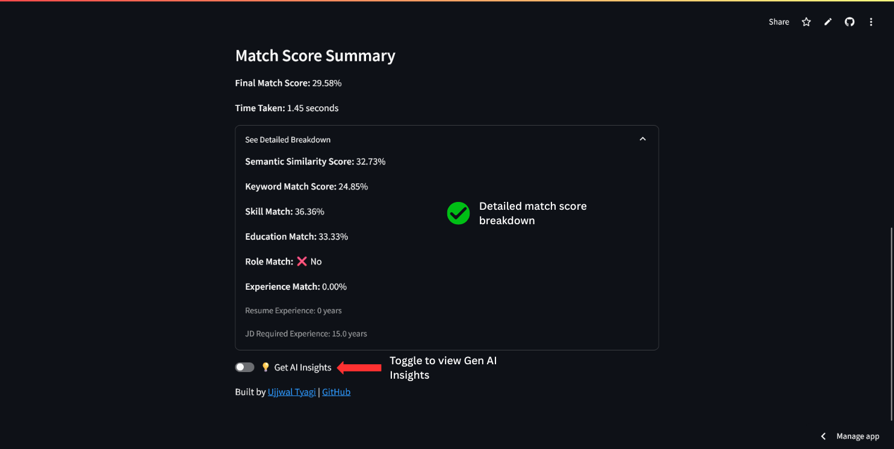

# Samarth - Resume Matcher

Samarth.AI is an AI-powered Resume-Job Matcher that helps job seekers assess how well their resume aligns with a given job description. Using a hybrid approach of Sentence-BERT and smart keyword analysis, Samarth.AI analyzes resumes, extracts key skills, and provides a relevance score with actionable insights.

🚀 **Live Demo:** [samarth.streamlit.app](https://samarth.streamlit.app/)  
🚀 **Mirror Link (if above link is down):** [https://samarth-resume-matcher.streamlit.app/](https://samarth-resume-matcher.streamlit.app/)

---

## Features

- 🔍 Semantic matching using Sentence-BERT (all-MiniLM-L6-v2)
- 🎯 Skill, education, role, and experience matching via keyword overlap
- 📊 Combined scoring (semantic + keyword-based)
- 💡 Insightful breakdown of match components (skills matched, experience gap, etc.)
- ⚡ Simple and interactive UI powered by Streamlit
- 🚧 Job description scraping via links — _coming soon!_

---

## How it works

1. Upload your resume as a PDF
2. Paste or (soon) link a job description
3. Get a detailed match score along with suggestions for improvement

---

## Web App Screenshots





---

## Getting Started

1. Clone the repository:
   ```bash
   git clone https://github.com/ujjwaltyagi2000/samarth.ai.git
   cd samarth.ai
   ```
2. Install dependencies:
   ```bash
   pip install -r requirements.txt
   ```
3. Run the app locally:
   ```bash
   streamlit run app.py
   ```

> 🔐 Note: The app uses a Hugging Face model and Gemini API. If needed, set your HF token and Gemini API key as an environment variable: `HF_TOKEN=your_token_here` and `GEMINI_API_KEY=your_key_here`.

---

## 🤝 Contributing

Contributions are welcome! Here’s how you can help:

- Report issues and suggest features
- Submit PRs for:
  - Improving skill/education extraction
  - Adding more JD input sources (e.g., PDFs or scraping improvements)
  - UI/UX enhancements
- Work on the upcoming **JD scraping** module

To contribute:

```bash
git checkout -b feature/your-feature-name
```

Submit a pull request once your changes are ready!

---

## License

This project is licensed under the MIT License.

Here’s the updated `README.md` with a **Tech Stack**, **Contributing**, and a note about the **JD scraping feature being in development**:

---
